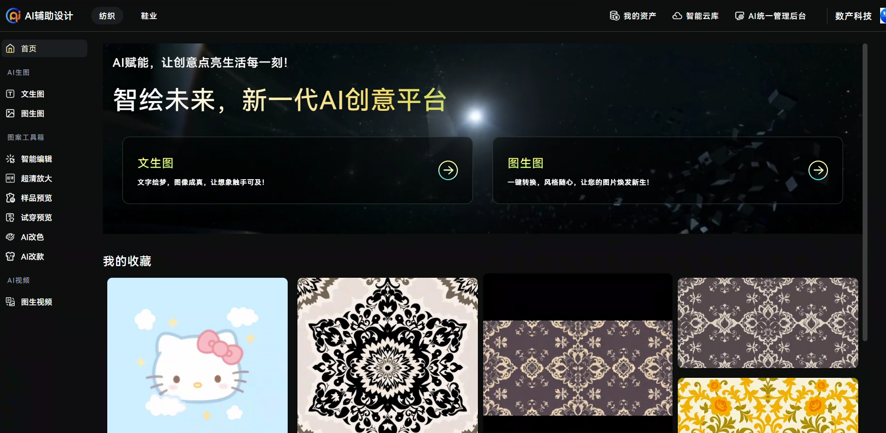

福州数字产业互联网技术 - AI技术顾问
====================================

## 公司信息

**公司名称**: 福州数字产业互联网技术  
**职位**: AI技术顾问  
**部门**: 技术研发部  
**工作地点**: 福州  
**工作时间**: 2023年9月 - 2024年12月, 2025年6月 - 2025年8月

## 工作概述

转型为AI技术顾问后，我专注于将前沿的AI技术应用到传统制造业中，主要负责AI辅助设计平台的开发和维护，为纺织业和鞋业提供AI驱动的设计解决方案。

## 核心AI项目

### AI辅助设计平台

**项目背景**: 为纺织业和鞋业提供AI驱动的设计解决方案，帮助设计师快速生成和修改设计图，提高设计效率和创新能力。

**项目部署**: https://utaidtest.fziip.com (需要登录权限)

**我的职责**:
- 作为AI技术顾问，负责整个AI辅助设计平台的技术架构设计
- 实现基于Stable Diffusion的图像生成工作流
- 开发专业的图像分割和编辑功能
- 针对垂直行业需求进行模型微调和优化

**核心AI功能**:
- **文生图 (Text-to-Image)**: 根据文字描述生成原始设计图
- **图生图 (Image-to-Image)**: 基于参考图像生成新的设计方案
- **局部编辑 (Inpainting)**: 精确编辑图像的特定区域
- **超清放大 (Super Resolution)**: 提升图像分辨率和质量
- **AI试衣 (Virtual Try-on)**: 虚拟试穿效果展示

**技术架构**:
- **ComfyUI工作流**: 设计多套专业的AI生成工作流，支持复杂的设计需求
- **Stable Diffusion系列模型**: 集成多个版本的SD模型，优化生成效果
- **LoRA微调**: 针对纺织和鞋业的专业术语（如蕾丝、贾卡等）进行模型微调
- **SAM ViT-Large**: 实现精确的图像分割，支持用户点击选择重设计区域

**行业适配**:
- **纺织业**: 支持蕾丝、贾卡、印花等专业设计元素的生成
- **鞋业**: 针对鞋款设计的特殊需求进行模型优化
- **专业术语处理**: 解决行业内专业术语的准确理解和图像生成

**产业链覆盖**:
纺织产品的完整制造流程包括两个关键环节：
- **设计师**: 负责原始设计图的创作（✅ 已通过AI解决，效率提升80%）
- **工艺师**: 将设计图转换成机台可执行的工艺流程（🔬 正在研究中）

我们目前专注于设计师环节的AI解决方案，已取得显著成效。工艺师环节面临更复杂的技术挑战，包括：
- **连续路径规划**: 机台通过逐行扫描进行针织，要求全程不能断线
- **线头优化**: 智能规划从边缘开始的一笔绘制路径，最小化非图案区域的路径
- **软件集成**: 需要与工艺师现有的专业软件系统进行无缝适配

**技术挑战与解决方案**:
- **专业术语理解**: 通过收集大量行业专业图片和术语，使用LoRA技术对模型进行微调
- **图像质量控制**: 建立多层质量检验机制，确保生成图像符合专业设计标准
- **性能优化**: 优化GPU使用效率，实现多用户并发访问的高性能服务
- **用户体验**: 设计直观的操作界面，降低专业设计师的使用门槛

**智能标注系统优化**:

在项目迭代过程中，我们面临一个关键技术挑战：当用户提供包含"贾卡"等专业元素的新训练图片时，现有的图片标注模型无法自动识别并标注这些专业术语，导致训练数据标注效率低下。

*技术架构*:
- **多模态标注**: Meta-Llama-3.1-8B-Instruct + SigLIP-So400m-patch14-384 (CLIP模型)
- **特征适配**: ImageAdapter进行图像特征识别和映射
- **微调策略**: 实现了ImageAdapter锁定和CLIP模型的端到端微调

*核心挑战*:
传统的端到端微调方法无法有效解决专业术语的自动标注问题。当模型遇到"贾卡"等行业专用术语时，由于缺乏相应的视觉-语义关联训练，无法准确识别并自动生成对应标签。这导致每次用户提供新的包含专业元素的图片时，都需要手动标注，严重影响了训练效率。

*解决方案探索*:
针对这一挑战，我们正在探索基于少样本学习和领域自适应的标注模型优化方案，研究如何在保持模型通用性的同时，增强对垂直领域专业术语的识别能力，以实现专业术语的准确自动标注。

**项目成果**:
- 成功部署了完整的AI辅助设计平台
- 实现了从概念到成品的完整设计流程
- **效率提升**: 为设计师节省80%的设计时间
- **服务规模**: 已为50+企业提供AI服务，客户数量持续增长
- 为传统制造业提供了AI转型的技术支持

**项目展示**:

*AI辅助设计平台主页界面*

.. image:: images/fuzhou_digital/lace_example.png
   :alt: 蕾丝设计样例
   :width: 600px
   :align: center

*蕾丝设计生成样例 - 展示了AI对专业纺织术语的理解能力*

.. image:: images/fuzhou_digital/shoe_example.jpg
   :alt: 鞋款设计样例
   :width: 600px
   :align: center

*鞋款设计生成样例 - 针对鞋业的专门优化*

.. image:: images/fuzhou_digital/segmentation_preview.png
   :alt: 图像分割预览
   :width: 700px
   :align: center

*SAM ViT-Large图像分割效果 - 精确分割设计元素区域*

## 技术栈

### AI与机器学习
- **深度学习框架**: Stable Diffusion, ComfyUI
- **计算机视觉**: SAM (Segment Anything Model), ViT-Large
- **模型微调**: LoRA (Low-Rank Adaptation)
- **图像处理**: OpenCV, PIL, Pillow
- **AI工作流**: ComfyUI节点编程

### 系统集成
- **AI服务架构**: Python FastAPI微服务架构
- **GPU计算**: CUDA, PyTorch
- **容器化**: Docker, GPU容器部署
- **模型管理**: 模型版本控制、热更新机制

### 开发工具
- **AI开发**: PyCharm, Jupyter Notebook
- **模型训练**: Google Colab, 本地GPU环境
- **版本控制**: Git LFS (大文件管理)
- **监控工具**: TensorBoard, Weights & Biases

## 工作成果

### 主要贡献
- **AI技术创新**: 成功开发了针对纺织业和鞋业的AI辅助设计平台，实现了从概念到成品的完整AI设计流程
- **垂直领域优化**: 通过LoRA微调技术解决了专业术语（蕾丝、贾卡等）的准确生成问题
- **AI架构设计**: 建立了完整的AI模型服务架构和部署体系
- **图像处理突破**: 集成SAM ViT-Large实现精确的图像分割，提升了设计编辑的用户体验
- **行业应用突破**: 为传统制造业提供了完整的AI转型解决方案

## 技能提升

### 技术能力
- **AI技术栈**: 深入掌握了Stable Diffusion、ComfyUI工作流设计和LoRA微调技术
- **计算机视觉**: 熟练运用SAM、ViT等先进的视觉模型进行图像分割和处理
- **模型优化**: 学会了针对特定行业需求进行AI模型的定制化开发和优化
- **AI系统架构**: 掌握了大规模AI应用系统的架构设计和优化能力
- **GPU编程**: 掌握了CUDA编程和GPU资源优化技术

### 软技能
- **跨领域沟通**: 增强了与设计师、产品经理以及传统制造业客户的沟通能力
- **技术领导力**: 作为AI技术顾问，提升了技术方案设计和团队指导能力
- **创新思维**: 培养了将前沿AI技术应用到传统行业的创新能力
- **问题解决**: 锻炼了处理复杂AI模型部署和优化问题的能力

## 工作感悟

作为AI技术顾问的这段经历让我深刻理解了AI技术在传统制造业中的巨大潜力和挑战。通过开发AI辅助设计平台，我不仅掌握了前沿的AI技术栈，更重要的是学会了如何将复杂的AI技术转化为实用的商业解决方案。

与纺织和鞋业的深度合作让我认识到，真正有价值的AI应用不仅需要技术创新，更需要对行业痛点的深度理解。每一个专业术语的准确理解，每一个设计元素的精确分割，都需要大量的行业知识积累和技术调优。

这段经历让我从一个技术实现者成长为技术顾问，学会了站在更高的角度思考技术与业务的结合，以及如何将前沿技术转化为实际的商业价值。

## 项目亮点

### AI技术创新
- **多模态AI集成**: 成功整合文生图、图生图、局部编辑、超清放大等多种AI功能
- **行业专用模型**: 通过LoRA微调技术实现了对纺织术语（蕾丝、贾卡）的精确理解
- **智能图像分割**: 集成SAM ViT-Large模型，实现像素级精确的设计元素分割
- **工作流自动化**: 设计多套ComfyUI工作流，支持复杂的AI设计流程

### AI技术架构突破
- **微服务架构**: 设计了高效的AI模型微服务架构，支持灵活的服务部署和扩展
- **GPU计算优化**: 实现了高效的CUDA加速和模型推理优化
- **可扩展设计**: 建立了支持多种AI模型热插拔的架构体系
- **性能优化**: 通过模型量化和推理优化，实现了生产级的服务性能

### 行业应用价值
- **解决痛点**: 针对纺织和鞋业设计效率低下的问题提供了AI解决方案
- **专业适配**: 深度理解行业需求，实现了专业术语到视觉效果的准确转换
- **用户体验**: 通过直观的界面和精确的分割功能大幅提升了设计师的工作效率
- **商业价值**: 为传统制造业的数字化转型提供了可落地的技术方案

这段AI技术顾问的经历为我在AI技术领域的发展奠定了坚实基础，特别是在计算机视觉、生成式AI和垂直领域应用方面积累了宝贵经验。
